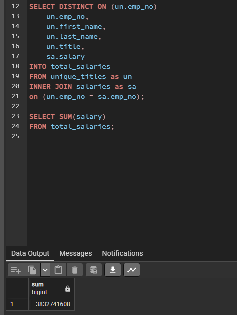
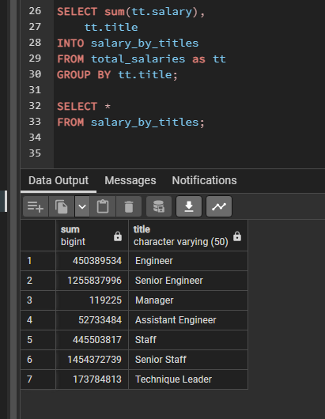

# Pewlett_Hackard_Analysis

## Purpose
### The purpose of this project is to determine the number of retiring employees per title, and identify employees who are eligible to participate in a mentorship program. This analysis will help prepare Bobby’s manager for the “silver tsunami” as many current employees reach retirement age.
### Deliverables would include:
####  1. The Number of Retiring Employees by Title
####  2. The Employees Eligible for the Mentorship Program

## Results
####  1.    The total number of employees getting ready to retire is 72,548 people.
####  2.    By far the larget titles about to retire are Senior Engineer and Senior Staff who account for the 50,842 out of 72,458 employees.
####  3.    As far as leadership there are only 2 managers and 3603 Technique leaders who are going to retire.     
####  4.    There are 1549 employees who are eligible for the mentorship program.

## Summary
#### The numbers of employees retiring by title is shown below

#### One of the most impactful number will also be how much salary will become available when all these employees retire.  That number is $3,832,741,608 using the following code.  

#### Lastly the data was reviewed to see how much salary was available by job title.  

